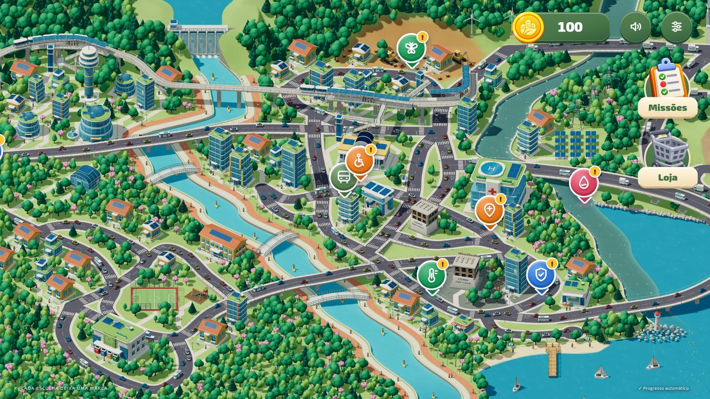
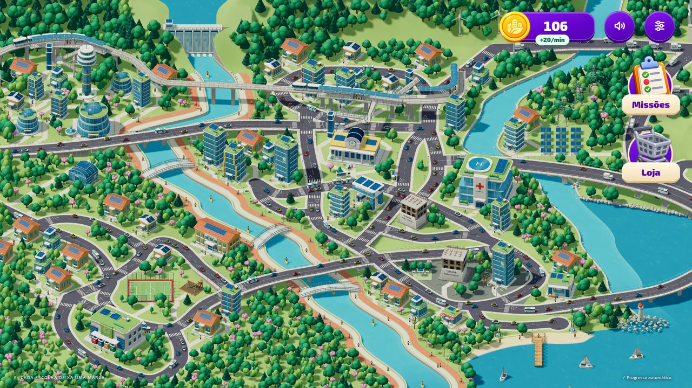
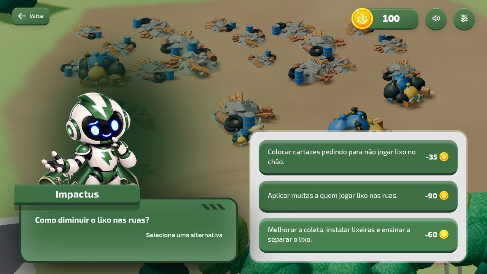
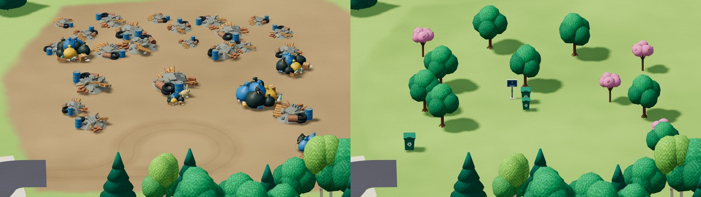
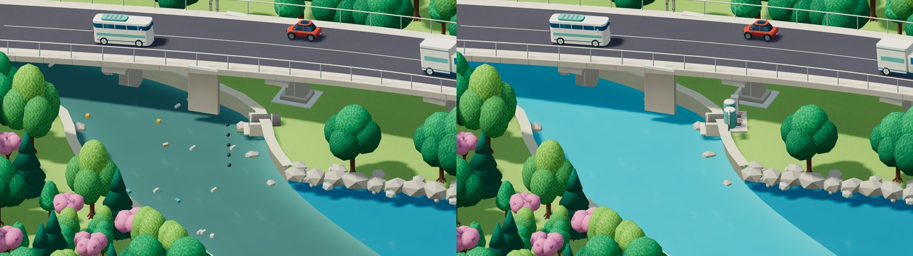
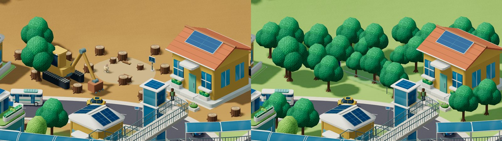
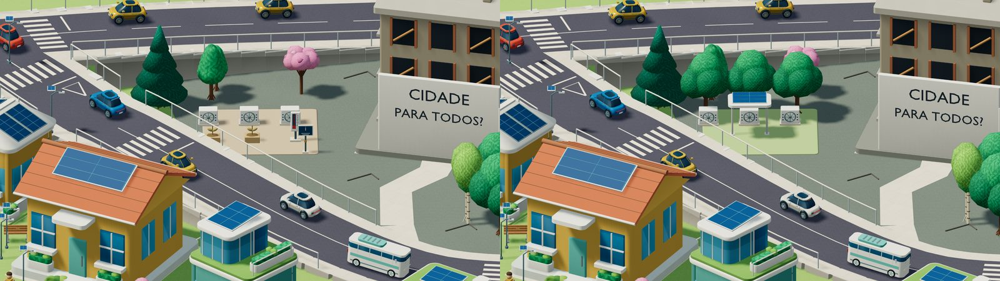
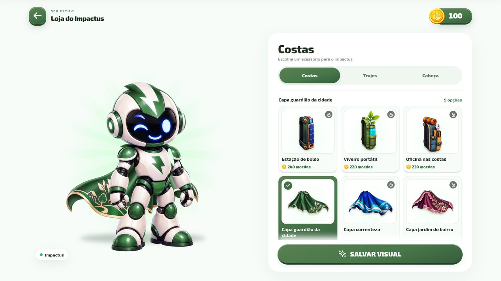
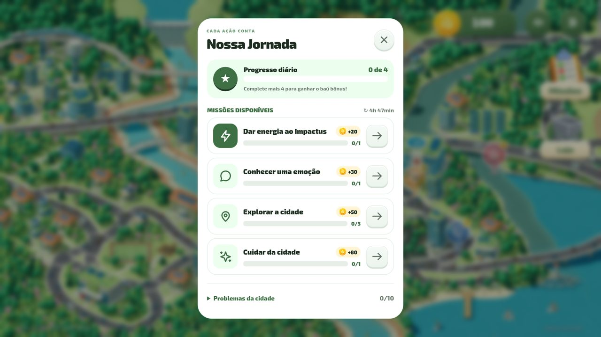

<div align="center">

# 🌱 Eco City!

### Um jogo 3D para aprender a cuidar da cidade e do meio ambiente

**Sem instalação. Direto no navegador, no computador ou no celular.**

[**▶ Jogar agora**](https://emanuelcandido.github.io/Jogo_INOVATECH/) · [Como funciona](#como-funciona) · [Para escolas e eventos](#para-escolas-e-eventos) · [Para quem desenvolve](#para-quem-desenvolve)



</div>

---

## O produto em uma frase

**Eco City!** é um jogo educativo de decisões em que a criança chega a uma cidade cheia de problemas reais (lixo nas ruas, rio poluído, floresta derrubada, trânsito que polui) e, junto com o robô **Impactus**, entende cada situação, escolhe a solução e **vê a cidade mudar na hora**.

Foi pensado para crianças do 4º ao 6º ano do ensino fundamental, mas qualquer pessoa joga: não há combate, tempo correndo nem fim de jogo por erro. Errar faz parte e sempre é possível tentar de novo.

<div align="center">

<br><sub>A mesma cidade depois das decisões do jogador.</sub>
</div>

## Por que funciona

| Em sala de aula costuma ser... | No Eco City! é... |
| --- | --- |
| Um tema distante, só em texto | Um lugar que a criança vê, explora e transforma |
| Uma resposta certa para decorar | Três alternativas com consequências diferentes, e a explicação de cada uma |
| Uma prova no fim | Um resultado imediato: o rio fica limpo, a floresta volta |
| Um conteúdo isolado | Dez situações ligadas pela mesma cidade, em cinco temas |

A criança aprende o raciocínio por trás da escolha: **observar, entender a causa e escolher a solução que resolve o problema de verdade**, e não só a que aparenta resolver. Multas e cartazes ajudam, mas não substituem lixeiras e coleta; a explicação do Impactus mostra por quê.

## Como funciona

<div align="center">

</div>

1. **Chegada.** O Impactus voa sobre a Eco City, pousa e convida o jogador a conhecer a cidade.
2. **Exploração.** O mapa 3D pode ser arrastado e ampliado. Cada problema aparece como um marcador colorido pelo tema.
3. **Entender.** Ao tocar num marcador, a câmera se aproxima do lugar e o Impactus explica a situação em linguagem simples.
4. **Decidir.** São três alternativas, cada uma com um custo em **Moedas da Cidade**. O preço não indica qual é a melhor: é preciso pensar.
5. **Ver a consequência.** A solução completa transforma o lugar com animações; a parcial melhora só um pouco; a fraca não resolve. O Impactus explica o resultado.
6. **Seguir em frente.** Resolver um problema libera outros e rende moedas. Com todos resolvidos, a câmera faz um passeio pela cidade transformada, seguido de uma tela de encerramento.

### Dez situações, cinco temas

| Tema | Situações |
| --- | --- |
| ♻ **Poluição** | Lixo nas ruas · Carros poluentes |
| ⚠ **Segurança** | Animais na estrada · Segurança nas ruas |
| 🌳 **Natureza** | Espécies ameaçadas · Mudanças climáticas |
| ✚ **Saúde** | Rio poluído · Fumaça e qualidade do ar |
| ♿ **Acessibilidade** | Caminho até o hospital · Acesso ao prédio |

<div align="center">
<br>
<br>
<br>

<br><sub>Quatro das dez situações: antes à esquerda, depois à direita.</sub>
</div>

## O que mantém a criança jogando

- **Companheiro com personalidade.** O Impactus reage com poses e falas diferentes a cada momento: pensa, se alerta, comemora.
- **Moedas e loja.** As moedas compram capas, jaquetas e chapéus para personalizar o Impactus, com **27 peças** divididas em coleções.
- **Missões diárias.** Quatro pequenos objetivos por dia (dar energia ao Impactus, conhecer uma emoção, explorar a cidade, cuidar de um problema) e um baú de bônus. Dão até 250 moedas por dia.
- **Renda passiva.** Cada lugar resolvido continua rendendo moedas enquanto o jogo está aberto, e por até uma hora com ele fechado, o que valoriza as soluções já feitas.
- **Música e sons originais.** Trilha tema, ambiente da cidade e efeitos de interface.

<div align="center">


</div>

## Para escolas e eventos

- **Entrada imediata.** Basta um link. Não exige conta, cadastro nem instalação, e o progresso fica salvo no próprio navegador.
- **Cabe em uma aula ou em uma visita ao estande.** Uma situação leva poucos minutos; as dez, a cidade inteira, cabem em algumas sessões.
- **Boa para conversar em grupo.** As alternativas geram debate: por que uma solução resolve e a outra só ameniza?
- **Pronta para telão.** Há um [vídeo de divulgação de 80 segundos em loop](docs/MATERIAL-DE-DIVULGACAO.md) para TVs de estande, em 1080p, com música e QR code para jogar no celular.
- **Funciona em aparelhos modestos.** O jogo mede o aparelho e escolhe sozinho entre seis perfis gráficos (do *Muito baixa* ao *Ultra*), e o jogador pode ajustar resolução, sombras e animações no menu.

## Qualidade técnica

| | |
| --- | --- |
| **Plataformas** | Navegadores modernos no computador e no celular, com toque, mouse e teclado |
| **Visual** | Cidade 3D com mais de 100 modelos próprios, vegetação instanciada, água animada e sombras |
| **Desempenho** | Renderização sob demanda, modelos comprimidos (meshopt), descarte do que está fora da câmera e perfis automáticos de qualidade. Veja [desempenho](docs/DESEMPENHO-IMPLEMENTADO.md) |
| **Acessibilidade** | Navegação por teclado, foco visível, alvos de toque grandes e respeito à opção *reduzir movimento* do sistema |
| **Progresso** | Salvo automaticamente com validação e versão, sem enviar dados para servidores |
| **Privacidade** | Sem login, sem anúncios e sem envio de dados do jogador: o jogo não faz chamadas a serviços externos |
| **Testes** | Suíte de testes unitários e de navegador (desktop e celular) cobrindo regras, economia, mapa, modelos, interface e fluxo completo |

## Para quem desenvolve

Tecnologias: **React 19**, **Three.js** com **React Three Fiber**, **Zustand**, **TypeScript** e **Vite**. Modelos em **GLB**, autorados no **Blender** (fontes em `assets-source/`).

Requer Node.js 22.12 ou superior.

```sh
npm ci
npm run dev        # servidor de desenvolvimento
npm run build      # versão de produção em dist/
npm run preview    # servir a versão de produção
npm test           # testes unitários
npx playwright install chromium
npm run test:e2e -- --workers=1   # testes de navegador
```

### Para onde olhar

```text
src/content/    textos, perguntas, situações, falas do Impactus e final
src/game/       regras puras: problemas, narrativa, economia, câmera, save
src/stores/     estado global e persistência
src/components/ cidade 3D, modelos, instâncias e efeitos de solução
src/ui/         interface, diálogos, loja, menus e cinemáticas
scripts/        geração do mapa, otimização de modelos, áudio e Blender
tests/          testes unitários e de navegador
docs/           documentação técnica e relatórios
```

Adicionar uma situação nova é uma mudança de conteúdo: cadastre texto, três alternativas e posição em `src/content/situations.ts` e os três estados visuais em `src/config/situationVisuals.ts`. O passo a passo está na [referência do projeto](docs/REFERENCIA-PROJETO.md).

### Publicação

O site é publicado no GitHub Pages a partir da branch `codex/public-game`, gerado com `--base=/Jogo_INOVATECH/`. Veja [publicação](docs/PUBLICACAO-PARA-TESTE-MOBILE.md).

### Documentação

| Assunto | Documento |
| --- | --- |
| Visão técnica e como estender | [REFERENCIA-PROJETO](docs/REFERENCIA-PROJETO.md) |
| Narrativa, situações e custos | [NARRATIVA-SITUACOES](docs/NARRATIVA-SITUACOES.md) |
| Economia de moedas | [RENDA-PASSIVA](docs/RENDA-PASSIVA.md) |
| Gráficos e perfis de qualidade | [GRAFICOS](docs/GRAFICOS.md) |
| Som e animações | [SOM-E-ANIMACOES](docs/SOM-E-ANIMACOES.md) |
| Loja e coleções | [LOJA-COLECOES](docs/LOJA-COLECOES.md) |
| Plano de 60 fps | [PLANO-60-FPS](docs/PLANO-60-FPS-DESKTOP-E-MOBILE.md) |

## Licença

Distribuído sob a licença [MIT](LICENSE). © 2026 Emanuel Cândido da Silva Lima.
