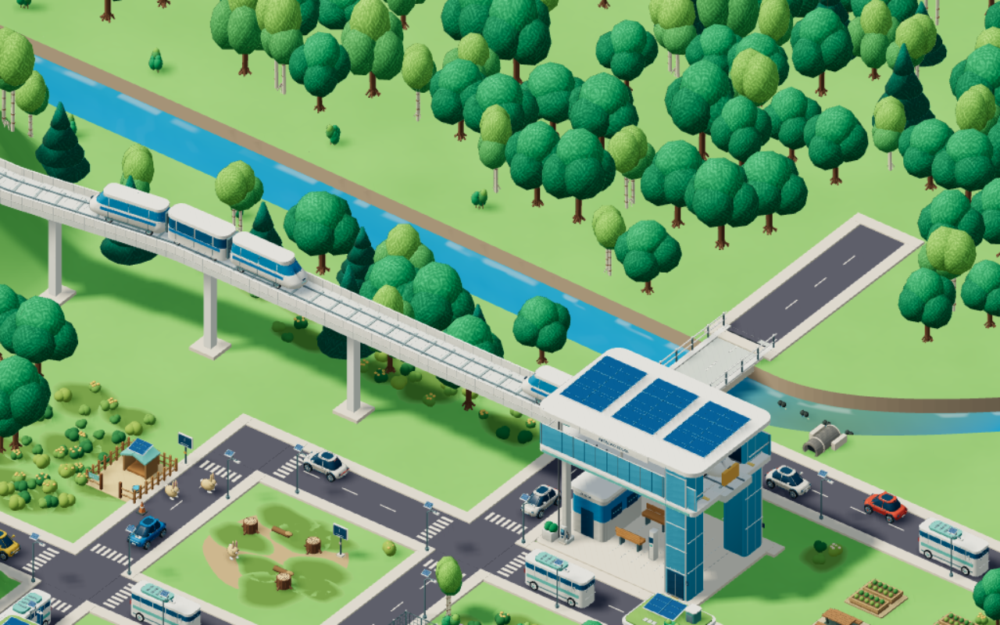
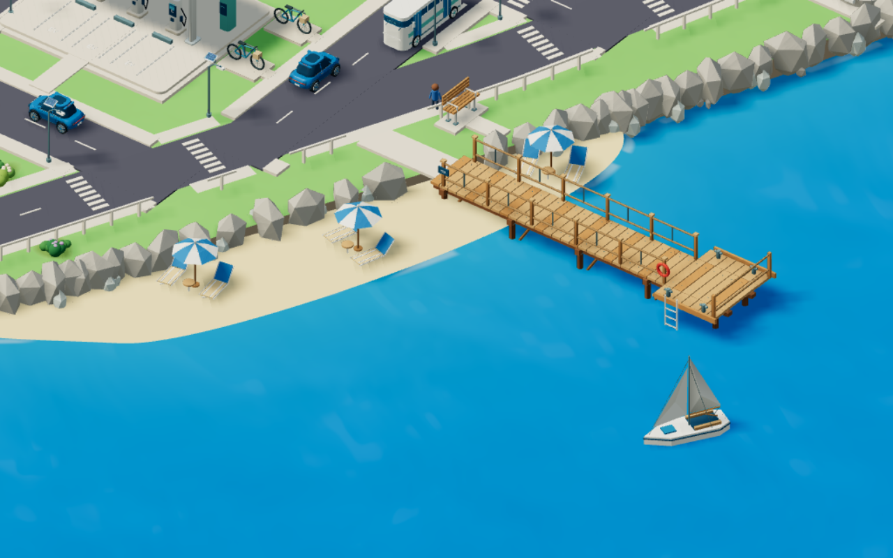
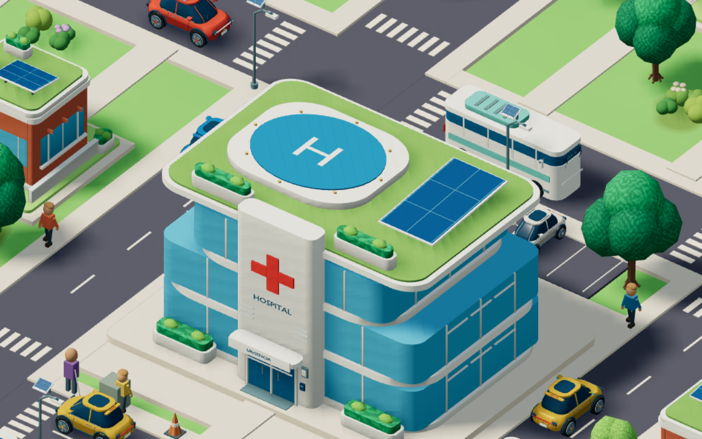

# Água e vegetação — revisão de 6 de setembro de 2026

O rio parecia começar de repente porque a camada da montanha desenhava triângulos planos sobre o canal. Esses triângulos foram removidos: o trecho segue pela mata, com margens contínuas, pedras e arbustos espaçados irregularmente antes da ponte.

Após a comparação visual, o contraste das ondas e da espuma foi reduzido. As faixas repetidas foram substituídas por campos de variação irregular em escalas diferentes, com movimento lento e sem linhas claras alinhadas.

A água usa transição entre áreas rasas e profundas, ondulações suaves sem faixas periódicas, reflexos discretos e espuma descontínua junto à costa. Alta e Ultra acrescentam normais finas e movimento; os perfis leves mantêm as cores e os detalhes estáticos. A faixa de poluição continua respondendo às escolhas do jogador. Não há uma segunda cena renderizada para reflexos.

As árvores usam folhas pontudas, nervuras e tons sobrepostos, sem o antigo relevo granulado. O padrão fica preso ao modelo e perde detalhe quando fica pequeno na tela. As flores usam pétalas arredondadas.

Os 13 modelos com cobertura verde foram reexportados, nas versões completa e leve, com o material `eco.roofgrass` separado das folhas. A grama tem variação suave e fibras finas, sem padrões grandes de folhagem. Os arquivos Blender também foram atualizados. Os detalhes procedurais de água, folhas e grama são aplicados no jogo; não são texturas bitmap dentro dos GLBs.

## Capturas do jogo

## Validação

58 testes unitários aprovados e compilação de produção concluída. O aviso existente sobre o tamanho do módulo Three.js permanece.

- Teste por raycast na geometria real do maciço cobre o canal de X = −98 a X = −23, em três posições transversais, sem triângulos da montanha tapando a água.
- Verificação dos 26 GLBs de edifícios confirma o material de grama próprio.
- Capturas de rio, costa, copas e hospital nos perfis Muito baixa e Alta, com sombras suaves fixadas para comparação e resolução de renderização de 80%. O navegador usa SwiftShader; esta conferência não é uma medição de FPS em dispositivos físicos.
- Registro de erros de navegador, carregamento e WebGL: [runtime.json](screenshots/future/nature/runtime.json).

Para repetir as capturas, iniciar o Vite na porta 5173 e executar 
ode scripts/review-nature.mjs nature`.

