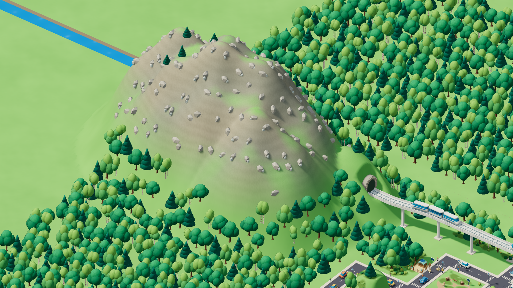
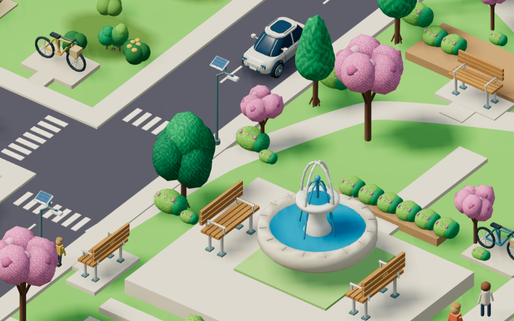

# Cidade futurista — implementação e polimento

Aplicação do planejamento de 6 de setembro de 2026. A transformação usa a referência enviada como direção de arquitetura: volumes arredondados, vidro azul, estruturas claras, jardins nas coberturas e mobilidade elétrica. O mapa mantém os bairros e suas funções.

[Abrir a galeria interativa](CIDADE-FUTURISTA.html). Ela compara a cidade anterior e a atual na mesma câmera, permite buscar os 77 modelos e mostra frente, verso e versão leve de cada um. As imagens são renderizações dos GLBs usados no jogo.

## Acabamento individual

### Segunda revisão: carros e Estação Solar

Os quatro carros receberam pintura acetinada própria, vidro escuro, recortes reais nas caixas de roda, molduras ajustadas à superfície do para-brisa e limpadores aderentes. Aros com ventilação, parafusos, sulcos discretos nos pneus, faróis segmentados, portas recortadas e teto panorâmico completam o acabamento. As variantes têm comprimentos e detalhes de teto diferentes.

A estação ganhou bilheteria no térreo, terminais, bancos com encosto, jardineiras, orientação tátil e acabamento das portas dos elevadores. Nas plataformas, os guarda-corpos são contínuos; a estrutura tem apoios arrematados, calhas, descidas de água, luminárias, identificação de embarque e subdivisões dos painéis solares. As adições mantêm a passagem ferroviária e a aproximação aos elevadores livres nos modelos completo e leve, verificadas por interseção de triângulos.

As cinco vistas individuais atualizadas têm resolução de 960 × 720, com frente, verso e versão leve na galeria. Validação desta revisão: 56 testes unitários, auditoria dos GLBs e compilação aprovados. O aviso sobre o tamanho do módulo Three.js permanece.

A conferência focada no mapa, em qualidade Média com modelos completos, terminou sem erros de navegador ou WebGL. As capturas de [carros](screenshots/future/cars-station/cars.png), [estação](screenshots/future/cars-station/station.png) e o [registro](screenshots/future/cars-station/runtime.json) documentam essa revisão.

Os 33 modelos futuristas têm uma etapa própria de polimento no gerador Blender, além da construção da forma principal. O registro por modelo está em [future-polish-notes.json](../assets-source/future-polish-notes.json).

| Conjunto | Forma e acabamento aplicados |
| --- | --- |
| Quatro torres residenciais/comerciais | Silhuetas curva, escalonada e com varandas; caixilhos, travessas, juntas, maçanetas, guarda-corpos, iluminação e equipamentos do térreo. |
| Quatro casas | Coberturas solares com cantos arredondados ou terraço verde; telhado fechado, módulos encaixados, beirais suaves, calhas, ferragens, interfone, caixa de correio e arremates de muro. |
| Hospital, escola e prefeitura | Fachadas e entradas próprias; heliponto separado dos painéis, balizadores, brises por sala, mural, colunas arrematadas, cúpula e relógio. |
| Escritório, café, indústria e galpão | Fachada cortina; toldos com borda, cadeiras e louça; docas numeradas, defensas, luminárias, grelhas, drenagem e manutenção das chaminés. |
| Quatro carros, ônibus e caminhão | Carrocerias arredondadas, para-brisas inclinados, faróis que acompanham as curvas, retrovisores, limpadores, rodas, placas, sensores e painéis de serviço. |
| Cabine, vagão, estação e abrigo | Frente afunilada do trem, articulações, ferragens e portas; plataformas, elevadores, piso tátil, painéis suspensos e encaixes da cobertura. |
| Recarga e tratamento do ar | Tela, leitor, fixações, ventilação, sinalização, ventiladores e painéis de manutenção; equipamento industrial colocado ao lado da fábrica e conectado por dutos. |
| Cobertura solar e três árvores | Espessura dos painéis, contraventamentos e bases; nervuras e anéis da palmeira, ramificações, volumes menores e variação tonal das copas. |

As placas receberam suportes próprios. As superfícies curvas usam normais contínuas, enquanto as faces planas mantêm seu aspecto plano. Vidro, pintura, metal e vegetação têm rugosidades próprias; o sombreado de contato é exportado em cores de vértice. O vidro usa material opaco estilizado, sem reflexos dinâmicos caros.

### Montanha e folhagem

A entrada ferroviária agora pertence a um maciço com cristas de aproximadamente 25 unidades de altura, encostas conectadas, afloramentos rochosos e variação entre terra, vegetação e pedra. A mata se concentra no sopé e dá lugar a coníferas menores em altitude. As encostas íngremes e as rochas têm áreas livres; o rio continua aberto. A câmera considera toda a área visível ao explorar essa região, evitando ultrapassar o limite da mata.

As onze famílias de árvores e arbustos receberam revisão de superfície no Blender. As palmeiras detalhadas têm folíolos separados e dobrados; as copas possuem irregularidades discretas. No jogo, um material procedural desenha folhas pontudas e nervuras com variação tonal, reduzindo o detalhe à distância. As versões completa e leve usam uma textura plana, sem o antigo relevo granulado. A textura fina é aplicada pelo renderer do jogo e pela galeria; ela não é uma imagem incorporada ao GLB.





O restante do catálogo mantém os conjuntos funcionais já detalhados, com materiais harmonizados e equipamentos solares onde cabem. Quadras, cercas, píer, embarcações, animais e vegetação natural continuam com suas funções e formas reconhecíveis.

### Rio, água e grama dos telhados

A [revisão de água e vegetação](AGUA-E-VEGETACAO.md) remove a tampa da montanha sobre o canal, acrescenta ondulações e áreas rasas e separa a grama suave das coberturas do padrão de folhas. Os 13 edifícios afetados foram reexportados nas duas variantes. Esta revisão passou em 58 testes e na compilação, com oito capturas do mapa sem erros de navegador/WebGL.

### Porto e limites da câmera

A [revisão do porto](PORTO-E-LIMITES.md) acrescenta 44 contêineres no cais, reconstrói o casco curvo do navio com 24 contêineres a bordo e aplica acabamento conforme o material. O arrasto e o zoom passam a respeitar os quatro cantos visíveis do mapa, em desktop e celular. Validação: 60 testes unitários, três cenários de navegação e compilação aprovados.

## Implantação

A [revisão de polimento e praia](POLIMENTO-E-PRAIA.md) suaviza os oito modelos de casas e torres, acrescenta leitura de vidro, calçada, asfalto e grama e cria o espraiamento da espuma sobre areia inclinada. As variantes completas e leves foram atualizadas; 62 testes e a compilação passaram, com conferência visual e das opções de animação.

- A ferrovia passa por um viaduto nivelado, com trilhos, travessas, parapeitos, apoios, terminal e estação. O túnel acompanha o relevo na borda da mata.
- Os apoios evitam ruas, calçadas e áreas de situação. A situação de desmatamento foi deslocada para a clareira em `[-25, -27]`.
- Entradas e coberturas têm encaixes exportados com suas dimensões reais. A colocação aplica posição, escala e rotação completas do edifício.
- Painéis e jardins essenciais pertencem ao GLB; os detalhes de cobertura antigos foram substituídos para evitar duplicação e peças suspensas.
- O percurso tátil do hospital termina na entrada atual. A prefeitura mantém a barreira que faz parte da situação inicial.
- Tratamento industrial e sombra solar aparecem apenas depois da solução correspondente. O equipamento do ar fica fora da área ocupada pelo caminhão de carga.

## Versões gráficas

Há **77 modelos completos e 45 variantes leves**, totalizando 122 GLBs. Muito baixa e Baixa usam as variantes leves; Média, Alta e Ultra usam os modelos completos. Os detalhes de cena continuam seguindo os [perfis gráficos](GRAFICOS.md).

As variantes são reconstruídas sem ferragens pequenas e com menos segmentos nas curvas; mantêm a arquitetura principal e os encaixes. A pré-carga acompanha a qualidade escolhida. Durante uma troca, o objeto anterior permanece visível até a nova variante terminar de carregar.

| Catálogo | Bytes GLB | Triângulos |
| --- | ---: | ---: |
| Seleção completa, 77 modelos | 15.351.964 | 369.962 |
| Seleção leve, substituindo os 45 modelos disponíveis | 8.948.220 | 205.765 |
| Todos os arquivos, incluindo ambas as variantes | 21.959.632 | 522.631 |

Esses totais descrevem arquivos, não a cena inteira instanciada ou o download de uma câmera. A seleção leve reduz aproximadamente 42% dos bytes e 44% dos triângulos do catálogo. O [catálogo JSON](future-catalog.json) registra cada modelo; a [auditoria](../assets-source/model-audit.json) registra os GLBs exportados.

## Validação

- 60 testes unitários aprovados: narrativa, geometria, limites dos lotes, calçadas, variantes, dimensões exportadas, encaixes, maciço, rio e apoios ferroviários.
- 18 cenários de navegador aprovados na transformação futurista, em desktop, Pixel 7 e tela de 360 × 640.
- Após a montanha, a textura de folhas e o novo limite de arrasto, os seis cenários de gráficos e navegação foram repetidos e aprovados nos três tamanhos de tela; a versão de produção foi recompilada pela suíte.
- Renderização individual dos 77 modelos, de frente, de verso e com a seleção leve.
- Dez situações inspecionadas nos estados inicial, temporário e resolvido. Cinco trocas de qualidade preservaram as transformações e cores; nenhum erro de navegador na revisão visual.
- Compilação de produção aprovada. O Vite ainda avisa sobre o tamanho do módulo Three.js, carregado separadamente da interface.

As medições de câmera e renderização estão em [baseline/runtime.json](screenshots/future/baseline/runtime.json) e [final/runtime.json](screenshots/future/final/runtime.json). O ambiente é Chromium com SwiftShader, renderização por software; seus tempos não equivalem ao FPS de celulares ou GPUs físicas. `modelBytes` acumula os recursos baixados desde a abertura da página, inclusive variantes já visitadas ao alternar perfis.

Medição anterior à segunda revisão de carros e estação, mantida como histórico junto ao JSON final. A revisão posterior teve capturas focadas, sem repetir esta medição de desempenho:

| Mesma câmera, cenário inicial | Anterior | Futurista com montanha |
| --- | ---: | ---: |
| Triângulos por quadro em Muito baixa | 1.124.669 | 755.429 |
| Triângulos por quadro em Alta | 3.562.643 | 3.652.882 |
| Mediana de renderização em Muito baixa, software | 6,6 ms | 7,0 ms |
| Mediana de renderização em Alta, software | 11,6 ms | 12,9 ms |

Os tempos medem 24 renderizações síncronas locais e variam com o uso da CPU. A queda na geometria em Muito baixa não implica melhora proporcional no tempo: a montanha e os novos materiais também têm custo de processamento.

## Reprodução

```powershell
npm run assets:build
node scripts/audit-models.mjs
npm test
npm run test:e2e -- --workers=1
```

A exportação usa o Blender instalado em `C:\Program Files\Blender Foundation\Blender 5.2\blender.exe` quando disponível. O script também aceita `-BlenderPath`. Os arquivos editáveis estão em `assets-source/*.blend`, e a autoria em `scripts/blender/future_city.py` e `scripts/blender/future_polish.py`.

Com o servidor de desenvolvimento na porta 5173, executar as capturas sequencialmente:

```powershell
node scripts/capture-models.mjs --future
node scripts/capture-models.mjs --future --rear
node scripts/capture-models.mjs --future --low
node scripts/review-future.mjs final
node scripts/review-future-situations.mjs
node scripts/document-future.mjs
```

O projeto continua funcionando no navegador, sem serviço de backend para jogar. A galeria é um documento de revisão; não é carregada durante a partida.
