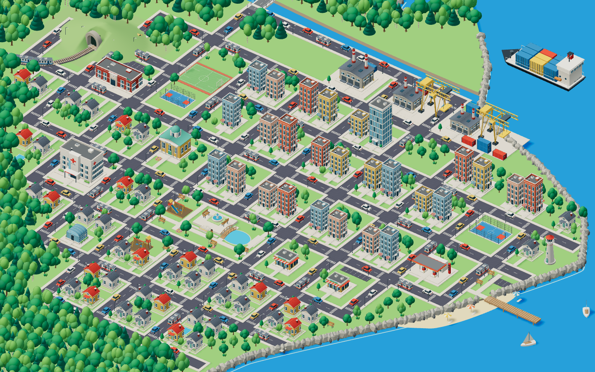

> Histórico da primeira expansão navegável. A composição mais recente está em [MAPA-REFERENCIA.md](MAPA-REFERENCIA.md).

# Cidade conectada e navegação do mapa

Atualização de 05/09/2026, baseada na referência de cidade em miniatura enviada pelo usuário.

A implantação passou a usar uma malha única de ruas, quatro pontes e lotes com frente definida. São 37 edifícios distribuídos entre centro, residências, escola, hospital e distrito industrial. O parque ganhou quadras, lago e passarela. A orla inclui passeio, píer, barcos a vela e guarda-sóis.

## Terreno e encaixes

- A base retangular foi substituída por duas superfícies de terreno com costa curva, areia, rochas e vegetação. Água ocupa o fundo da cena.
- O rio é um canal aberto entre essas superfícies. A mesma água continua até o mar nas duas extremidades, sem uma faixa de textura terminando sobre a grama.
- Ruas e calçadas são geradas por uma única configuração. As pistas terminam em cruzamentos da própria rede. Marcações são interrompidas junto aos cruzamentos.
- As pontes têm o piso alinhado com o asfalto e possuem passeios e guarda-corpos.
- Cada edifício declara um lote e a rua para a qual está voltado. Uma ligação pavimentada atravessa o jardim até a entrada. As dimensões exportadas dos GLBs são verificadas para impedir fachadas e marquises sobre as pistas.
- O local da missão de resíduos recebeu piso e pequenos ajustes de posicionamento. O personagem fica ao lado do jardim, fora da pista.

Os 33 modelos GLB existentes foram reaproveitados. Os pequenos modelos adicionais de barcos, guarda-sóis e passarela são geometrias locais em `src/components/environment/Waterfront.tsx`; eles não possuem arquivos Blender novos. O cenário usa instanciamento para repetir os modelos existentes.

## Controles

- Mouse: arrastar com o botão principal; roda para aproximar ou afastar.
- Toque: arrastar com um dedo; pinça com dois dedos, incluindo deslocamento simultâneo.
- Botões: aproximar, afastar e centralizar.
- Teclado, com o mapa focado: setas para deslocar, `+` / `-` para zoom e `Home` para centralizar.
- Zoom de 100% a 350%. O centro da câmera fica limitado à área urbana.

A exploração fica disponível na visão geral. Ao abrir uma missão, a câmera assume o enquadramento narrativo. O retorno restaura a visão geral e reativa os controles sem repetir a animação. Movimentar o mapa não modifica o progresso salvo.

## Verificação

`npm test` inclui auditoria das dimensões reais dos GLBs, posição dos lotes em relação às pistas, pontes, referências de assets e limites de navegação, além dos testes narrativos existentes.

`npx playwright test --workers=1` verifica os fluxos de diálogo, decisões, saldo, salvamento e navegação em 1440×900, Pixel 7 e 360×640. A navegação inclui arrasto de mouse, toque nativo no Chromium, pinça, teclado, limites e retorno de missão.

`node scripts/capture-city.mjs` produz capturas da visão geral, zoom e missão do rio nos três formatos, usando o servidor local na porta 5173. Também produz `docs/screenshots/city-landscape.png`, sem a interface, para inspecionar a implantação.

Os testes de celular são emulação de navegador. A taxa de quadros em aparelhos físicos não foi medida.

Resultado da validação: 28 testes unitários passaram, incluindo os limites reais dos modelos e o recorte do mar nos cantos de telas 1440×900, 412×839, 360×640 e 360×1000. A suíte completa de 18 testes de navegador passou antes dos ajustes finais de recorte e retorno; os fluxos diretamente afetados foram selecionados novamente para a conferência final.
Os seis testes finais de navegação e restauração passaram nos três formatos de tela. O build de produção também passou. A câmera usa a área completa do mapa desde o início do retorno, aguarda o redimensionamento antes de habilitar os controles e mantém o plano do mar dentro do recorte da visão geral.

As capturas finais foram concluídas nos três formatos, com zoom retornando a 100%, sem erros JavaScript ou falhas de download dos modelos e sem rolagem horizontal. A visão geral, o zoom e o enquadramento da missão do rio foram inspecionados visualmente; a faixa de recorte do mar na tela alta foi eliminada.

