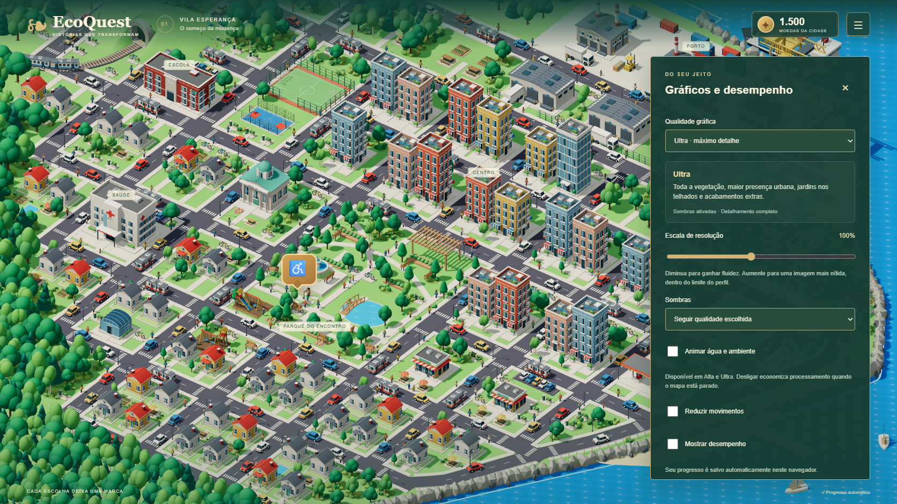
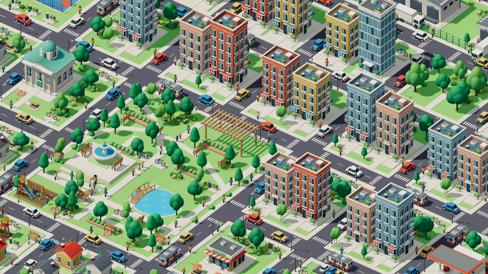
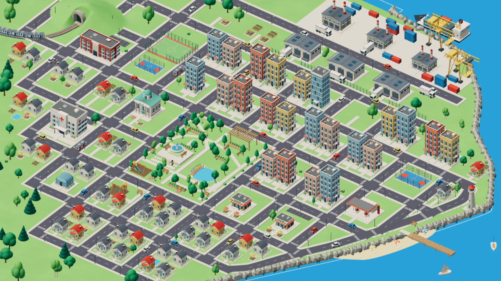

# Gráficos e desempenho

Abra o menu **Configurações** e escolha **Qualidade gráfica**. As mudanças são aplicadas durante a partida e salvas neste navegador. O mapa, os 77 edifícios principais, o personagem, as alternativas e as consequências das missões permanecem disponíveis em todos os níveis.

| Perfil | Floresta¹ | Partes decorativas dos jardins | Conjuntos urbanos extras | Sombras padrão | Limite de pixels |
| --- | ---: | ---: | ---: | --- | ---: |
| Muito baixa | 465 | 828 | 0 | Desativadas | 0,8 milhão |
| Baixa | 1.048 | 2.172 | 0 | Desativadas | 1,4 milhão |
| Média | 2.018 | 5.410 | 0 | 1.024 px | 2,6 milhões |
| Alta | 3.106 | 8.891 | 181 | 2.048 px | 4,5 milhões |
| Ultra | 3.883 | 11.220 | 463 | 4.096 px | 6,5 milhões |

¹ Instâncias da camada de mata e árvores urbanas. As árvores do parque e dos jardins complementares são contabilizadas à parte. Contagens de instâncias não equivalem a chamadas de desenho nem a FPS.

Alta e Ultra acrescentam moradores nas calçadas, bicicletas e suportes, jardineiras, lixeiras, carros estacionados, jardins de cobertura, terraços, painéis solares, empilhadeiras e paletes. Ultra contém 5.757 peças adicionais, agrupadas por geometria e instância. A camada extra tem carregamento separado e só é solicitada ao usar Alta ou Ultra. O kit de 51 GLBs continua compartilhado.

## Ajustes individuais

- **Escala de resolução, de 60% a 150%:** reduz ou aumenta a resolução do cenário, respeitando o orçamento de pixels do perfil e o limite da GPU. A interface mantém sua resolução nativa.
- **Sombras:** seguir o perfil, desativadas, suaves ou detalhadas. Os mapas de sombra são reconstruídos ao trocar a resolução, evitando reaproveitar uma textura de tamanho anterior.
- **Animar água e ambiente:** pequenas ondulações em Alta e Ultra, sem renderizar uma segunda cena para reflexos. Com o mapa parado, a animação solicita até 30 atualizações por segundo e pausa quando a aba fica oculta.
- **Reduzir movimentos:** também interrompe a animação decorativa da água, mantendo os detalhes estáticos e a navegação.
- **Mostrar desempenho:** exibe o FPS de uma amostra curta de renderização. É uma medição local, não uma promessa de taxa constante.

## Automático

Novas partidas começam em Automático. O perfil inicial considera os dados disponíveis de memória, núcleos, tipo de interação e renderizador por software. Sem dados completos, usa uma escolha conservadora.

Após preparar a cena, o jogo renderiza uma amostra com aquecimento e usa o tempo mediano entre quadros. Se ele ultrapassar 36 ms, reduz um nível e mede novamente. Tempo parado no modo de renderização sob demanda não entra na amostra. Novas amostras podem ocorrer após explorar o mapa, com intervalo mínimo de 12 segundos. Não há oscilação automática para níveis superiores; **Reavaliar dispositivo** reinicia a avaliação. Uma qualidade escolhida manualmente nunca é reduzida por essa medição.

A escolha automática é uma estimativa: navegador, GPU, temperatura e outros programas influenciam a fluidez. O jogo requer suporte a WebGL 2. Não foi validado em todos os dispositivos físicos.

## Compatibilidade e verificações

Saves anteriores com LOW, MEDIUM e HIGH são migrados sem apagar progresso e sem mudar a qualidade escolhida. As novas preferências recebem valores padrão. Valores de resolução fora da faixa são limitados.

Os testes unitários cobrem migração, persistência, escolhas manuais, limites de pixels, seleção automática e implantação dos novos objetos. O teste de navegador percorre todos os perfis na mesma instância do Canvas, ajusta resolução e sombras, recarrega o save e verifica o modo Automático em desktop, Pixel 7 e 360 × 640. As emulações usam SwiftShader; seus FPS não representam uma GPU física.

Validação desta entrega: 39 testes unitários e 18 cenários de navegador passaram: três de gráficos, três de carregamento e 12 de missões e navegação. A resolução física do Canvas também é conferida depois de mudar outras opções e recarregar a partida. O teste permite até 30 segundos para essa leitura, pois o SwiftShader pode ocupar o navegador durante a preparação dos modelos. A captura comparativa de Muito baixa e Ultra não registrou erros de WebGL. A compilação passou, mantendo o aviso do Vite sobre o tamanho do módulo Three.js.

Comandos reproduzíveis:

```sh
npm test
npx playwright test tests/e2e/graphics.spec.ts tests/e2e/loading.spec.ts tests/e2e/loop.spec.ts tests/e2e/navigation.spec.ts --workers=1
node scripts/audit-graphics.mjs
node scripts/capture-graphics.mjs
```

As capturas precisam do servidor local na porta 5173.






