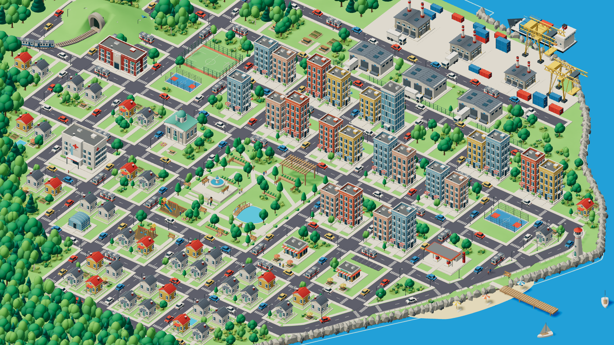
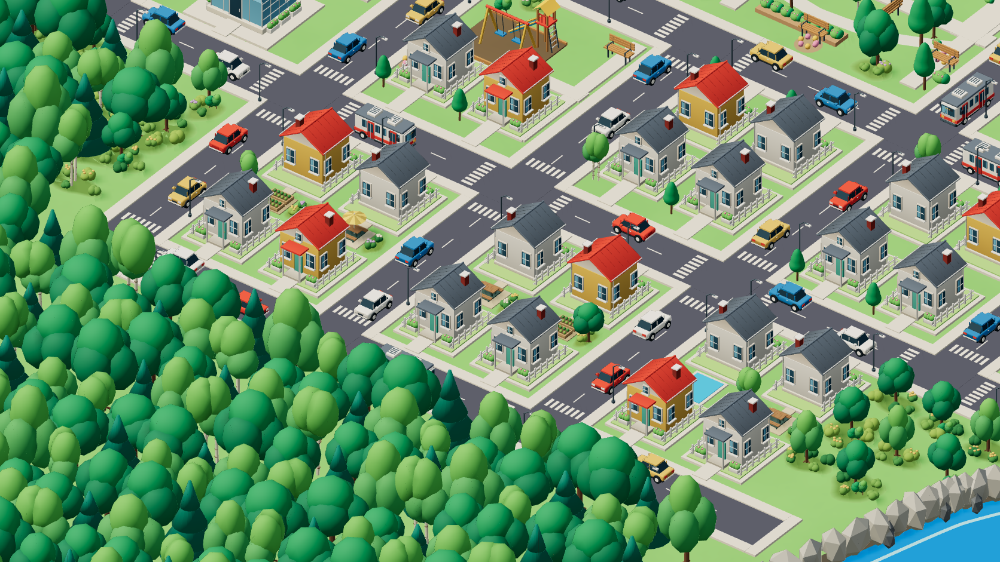
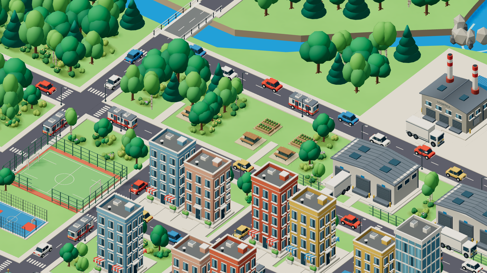
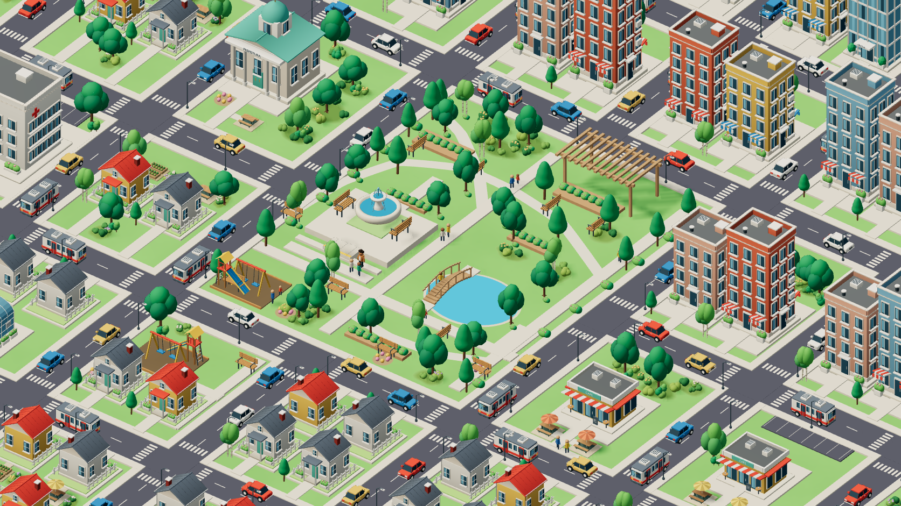

# Composição da cidade — revisão da montagem

O mapa atual utiliza 77 construções e 51 modelos GLB. O objetivo desta revisão foi aproximar a disposição dos conjuntos da referência: escola e ferrovia à esquerda, hospital abaixo da escola, prefeitura próxima ao centro, parque amplo entre os bairros e o corredor de prédios, porto ao fundo à direita e avenida curva acompanhando a costa.

A [comparação visual](COMPARACAO-MAPA.html) oferece imagens lado a lado e sobreposição. A captura do jogo usa 1672 × 941, a mesma proporção da referência. Os modelos permanecem uma interpretação em 3D para navegador; a comparação permite avaliar as diferenças de composição e acabamento.

A revisão posterior de [gráficos e desempenho](GRAFICOS.md) acrescenta cinco níveis manuais, Automático e detalhes adicionais em Alta/Ultra. As imagens desta página registram a montagem anterior a essa camada extra; as capturas novas estão na documentação gráfica.

## Mudanças de montagem

- A projeção da câmera foi calibrada aos eixos das ruas da referência.
- Prédios centrais foram alargados, aproximados e distribuídos em alturas diferentes. Casas ocupam o lado esquerdo e o primeiro plano.
- A escola ganhou um terceiro pavimento. O campus reúne campo marcado, gols com redes, quadra de basquete, estacionamento e cercamento.
- O parque substitui quatro prédios e uma rua interior. Inclui fonte, lago maior, passarela de madeira, caminhos curvos, canteiros, pergolado, bancos, playground e visitantes.
- O porto foi reposicionado ao fundo. Possui fábricas, três galpões com docas, caminhões, guindastes e contêineres empilhados, com portões no cercamento do pátio.
- A avenida costeira segue uma curva contínua. Seus encontros com as ruas são calculados a partir da curva, incluindo passeios, faixas, postes e guarda-corpos.
- Farol, praia, guarda-sóis, píer e barcos completam a orla. O continente continua a oeste e ao norte; o rio desemboca no mar.
- Árvores de copas e alturas variadas formam a mata e jardins menores. Reservas de espaço impedem o plantio automático em pistas, pátios, acessos e equipamentos públicos.
- Os terrenos ganharam 30 espaços mobiliados: 20 quintais com hortas ou mesas, quatro esplanadas de café e áreas de descanso e cultivo nos jardins públicos. O mobiliário inclui ripas, apoios, guarda-sóis com gomos e hortas com bordas de madeira e fileiras de plantas.
- 472 ilhas de vegetação baixa têm contornos irregulares, bordas de cor suavizadas, arbustos com volumes sobrepostos e pequenas flores. Mais 47 árvores completam os grupos; a posição das árvores anteriores foi ajustada para acomodar os quintais. A grama varia suavemente de tonalidade em coordenadas do mundo, inclusive no morro.
- Uma piscina que coincidia com uma casa foi removida; as duas piscinas situadas em áreas livres foram preservadas.
- Pisos rasos recebem sombras sem projetar sombras sobre si mesmos; o deslocamento do mapa de sombras foi ajustado para reduzir listras artificiais no asfalto e nos passeios.

As missões mantêm seus identificadores, regras, alternativas e progresso salvo. Seus pontos e câmeras foram reposicionados com a praça. Zoom, arrasto, pinça, teclado e centralização continuam disponíveis na visão geral.

## Arquivos principais

| Elemento | Fonte |
| --- | --- |
| Projeção e enquadramento | `src/config/referenceFrame.ts` |
| Lotes, modelos e vegetação | `src/config/districts.ts` |
| Ruas, calçadas e píer | `src/config/infrastructure.ts` |
| Avenida costeira | `src/config/coastalRoad.ts` e `src/components/environment/CoastalAvenue.tsx` |
| Continente, costa e rio | `src/config/terrain.ts` |
| Campus e ferrovia | `src/components/environment/CivicScenery.tsx` e `src/config/railway.ts` |
| Parque | `src/components/environment/ParkGarden.tsx` e `Waterfront.tsx` |
| Jardins, quintais e esplanadas | `src/config/landscape.ts` e `src/components/environment/Landscape.tsx` |
| Variação da grama | `src/components/environment/GrassMaterial.tsx` |

## Modelos

O conjunto tem 51 GLBs, 6.000.920 bytes e 147.598 triângulos nos arquivos únicos. As instâncias da cena têm contagem diferente. Todos os GLBs possuem oclusão em cores de vértices e arquivos `.blend` editáveis em `assets-source`.

Os dois modelos adicionados nesta montagem são o galpão portuário e o caminhão de entregas, gerados em `scripts/blender/port_details.py`. O galpão possui docas, portas de enrolar, claraboias, emendas no telhado, calhas e condutores. O caminhão possui cabine, vidros, retrovisores, rodas, faróis e travas traseiras.

Os cinco modelos de árvores para grupos continuam disponíveis: carvalho, copa alta, bétula, conífera e árvores jovens. A [revisão dos modelos](REVISAO-MODELOS.md) detalha os acabamentos do restante do kit.

Para reexportar: `npm run assets:build`. O argumento Blender `--only port-warehouse,delivery-truck` seleciona modelos; `--expansion-only` exporta os 18 modelos da expansão. Depois, execute `npm run assets:optimize`.

## Verificação

Os 31 testes unitários passaram. A verificação de implantação lê os limites reais dos GLBs e cobre lotes, interseção entre edifícios, pistas retas e curvas, calçadas de ruas e de entrada dos lotes, apoio em terra, rio, ponte e câmera. A nova verificação do paisagismo confere a separação entre mobiliário, pistas e acessos, além das bordas dos canteiros e do apoio dos detalhes em terra.

Na revisão da montagem, a suíte completa de navegador aprovou 16 dos 18 cenários. Após sincronizar a checagem dos controles com o fim da transição de retorno, os três cenários de navegação (desktop, Pixel 7 e 360 × 640) foram repetidos e passaram. Depois do novo paisagismo, esses três cenários voltaram a passar, cobrindo arrasto, zoom, pinça, teclado, limites, centralização e retorno de missão. A compilação de produção passou; o Vite mantém o aviso de tamanho do módulo Three.js. O desempenho em aparelhos físicos não foi medido.

Auditorias reproduzíveis: `node scripts/audit-models.mjs` e `node scripts/audit-city.mjs`.

Capturas, com servidor na porta 5173: `node scripts/capture-city.mjs city-reference --overview-only`. Também estão disponíveis `city-desktop`, `city-mobile` e `city-small`. Sem `--overview-only`, o script percorre as duas missões.

Detalhes dos terrenos com zoom: `node scripts/capture-landscape.mjs`. O mobiliário e a vegetação baixa desta revisão são geometrias 3D agrupadas por instância em quatro conjuntos de desenho; não acrescentam downloads de GLBs ao kit.

