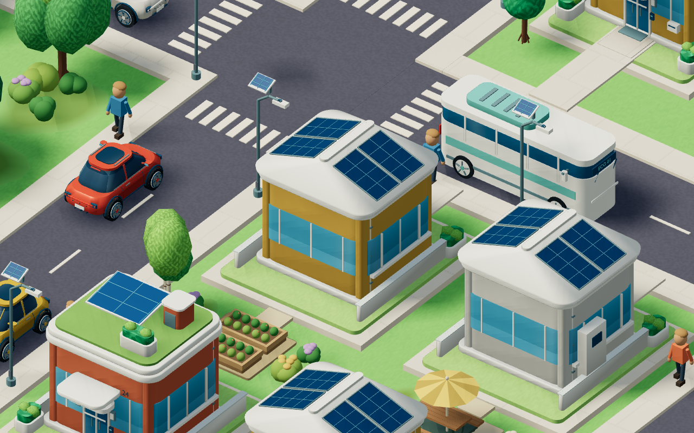
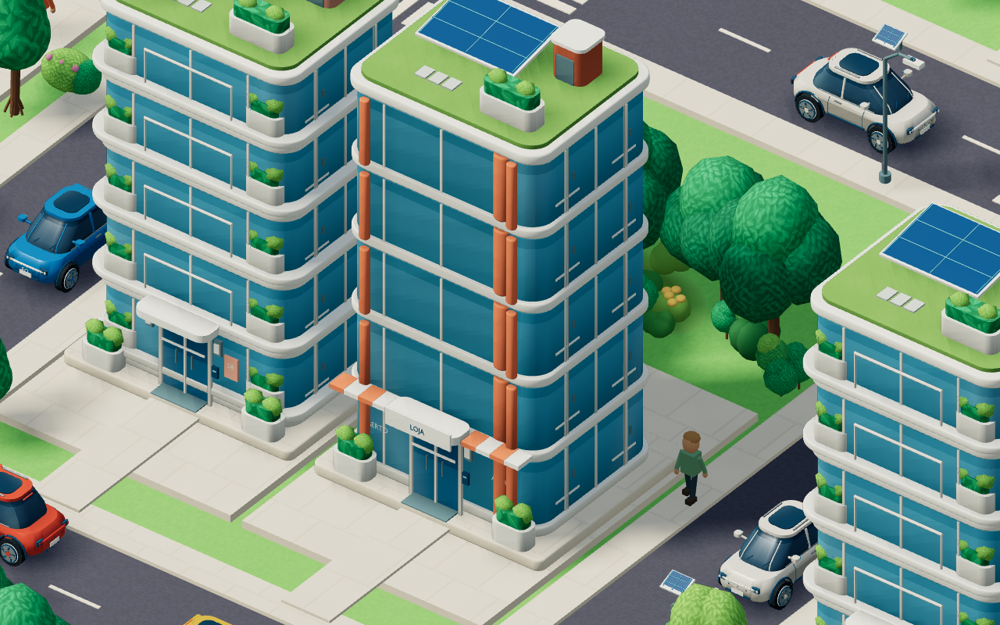
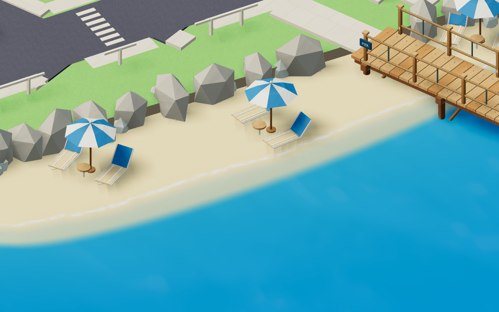
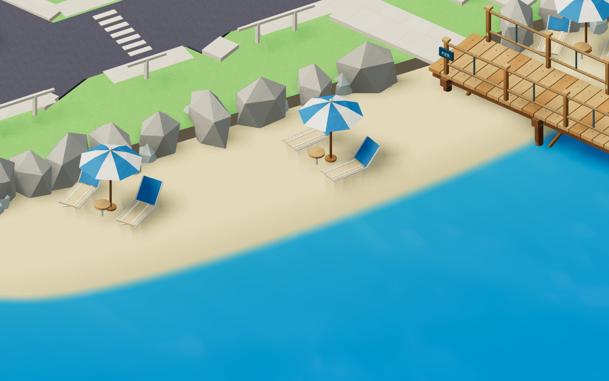

# Polimento de arquitetura, materiais e praia

Revisão de 6 de setembro de 2026. As quatro casas e as quatro torres residenciais/comerciais foram atualizadas nos arquivos Blender e nos GLBs completos e leves.

As casas solares têm uma cobertura fechada que contorna os quatro lados, com beirais arredondados e módulos solares encaixados nas inclinações. Bases, cornijas, lajes, varandas e elementos coloridos de fachada têm pequenos arredondamentos que recebem luz nas bordas. Os acessos e os limites dos lotes continuam válidos.

O vidro recebe gradação suave e reflexos estilizados; a pintura, o metal e a madeira mantêm acabamentos próprios. Calçadas têm juntas discretas e variação entre placas. Asfalto e grama têm detalhe fino filtrado à distância. Os materiais de pavimento e terreno usam coordenadas do mundo, inclusive nas instâncias: ampliar uma peça não amplia os grãos da textura. Esses efeitos são procedurais, aplicados no jogo e na galeria, sem imagens externas ou uma segunda renderização de reflexos.

A faixa de areia desce até uma parte submersa. A espuma avança com pequenas diferenças ao longo da costa e recua mais lentamente, deixando uma faixa de areia molhada. A transparência junto ao mar elimina o corte entre a areia e a água. A faixa seca foi ampliada e um conjunto de cadeiras foi deslocado ligeiramente para manter os pés apoiados.

Alta e Ultra animam a espuma quando “Animar água e ambiente” está ativado. “Reduzir movimentos” interrompe a animação. Os perfis mais leves mantêm o acabamento estático. A praia acrescenta uma malha compartilhada e um material; não cria partículas ou folhas de espuma sobrepostas.

## Validação

- 62 testes aprovados e compilação de produção concluída. Permanece o aviso do Vite sobre o tamanho do módulo Three.js.
- Raycasts nos pés das espreguiçadeiras confirmam a faixa plana; a geometria da areia desce continuamente e cruza o nível do mar uma vez em cada seção.
- Os testes de implantação e variantes confirmam que os modelos continuam dentro dos lotes, com encaixes e dimensões válidos.
- Capturas das 18 construções atualizadas de frente, de verso e na versão leve para a galeria.
- Conferência do mapa em Alta e Muito baixa, incluindo ativação da animação e redução de movimentos pelos controles reais: [registro](screenshots/future/architecture/runtime.json). A forma final da faixa seca foi conferida novamente: [registro da praia](screenshots/future/architecture/shore-runtime.json).

O navegador de revisão usa SwiftShader; a conferência visual não mede desempenho de uma GPU física.

Para reproduzir, iniciar o Vite na porta 5173 e executar `node scripts/review-architecture.mjs`. A opção `--shore-only` atualiza apenas as capturas da praia.
