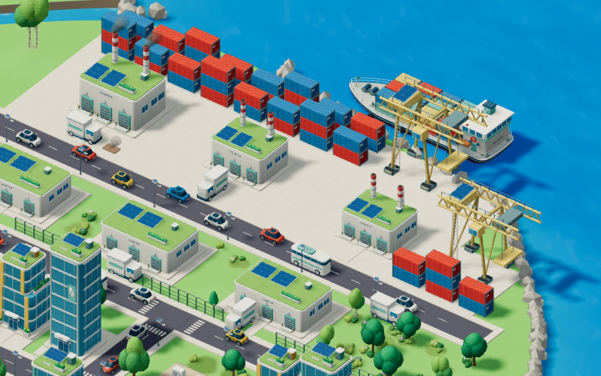
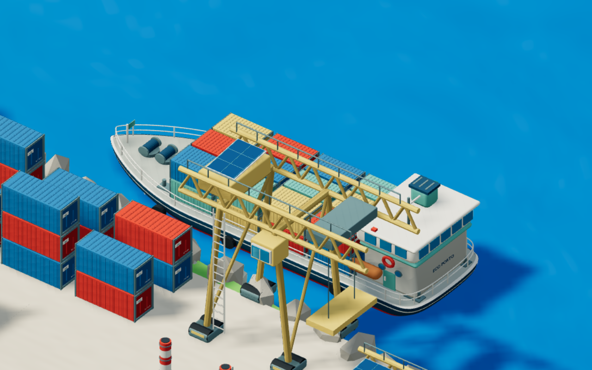
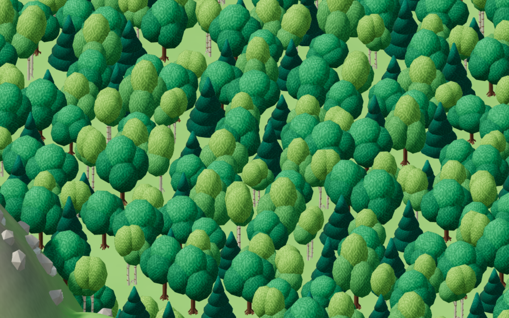
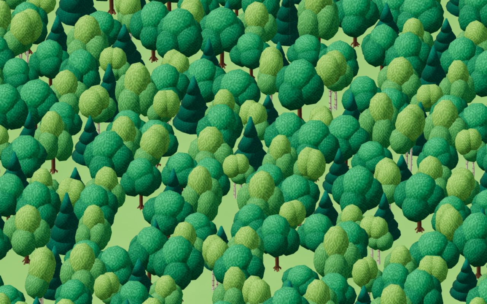

# Porto, limites de exploração e materiais

## Limite da câmera

O arrasto considera os quatro cantos visíveis no chão, o zoom e o formato da tela. Reduzir o zoom reajusta a posição antes que apareça o terreno vazio além da mata. Em telas altas, o afastamento máximo também é limitado. Mouse, teclado, pinça, centralização e retorno das missões usam o mesmo limite. A região da montanha permanece explorável dentro desse enquadramento.

## Porto

O cais passou de 16 para 44 contêineres, em pilhas de duas e três unidades. Os corredores, prédios, caminhões, guindastes e água foram verificados com os volumes reais dos modelos. As unidades superiores têm apoio nas inferiores.

O navio tem casco com curvas contínuas, popa arredondada, proa afilada com transição curva, faixa de borda, convés fechado e guarda-corpos que acompanham o contorno. A carga usa 24 contêineres corrugados; cabine arredondada, janelas, portas, vigias, radar, luzes de navegação, guinchos, cabeços de amarração e barco de resgate completam o modelo.

O arquivo Blender e o gerador foram atualizados. O navio também ganhou uma variante leve: 18.589 triângulos, contra 35.148 da versão completa. O catálogo tem 77 modelos completos e 45 variantes leves, totalizando 122 GLBs.

## Texturas das superfícies

Os materiais do jogo e da galeria recebem acabamento procedural discreto: concreto com granulação fina, metal com marcas direcionais, madeira com veios, asfalto com agregado e pintura com microvariação de cor e rugosidade. O padrão acompanha as coordenadas do modelo e perde detalhe quando fica pequeno na tela. Vidros, folhas, água e grama conservam seus tratamentos próprios. Esses detalhes são aplicados no navegador, não incorporados como imagens aos GLBs.

## Validação

60 testes unitários aprovados. A verificação da câmera cobre cinco formatos de tela, quatro ampliações e arrastos aos quatro extremos. A navegação foi testada no desktop, Pixel 7 e tela de 360 × 640, incluindo pinça, teclado e retorno de missão. Compilação aprovada; permanece o aviso existente de tamanho do módulo Three.js.

As capturas abaixo usam os modelos completos, sombras suaves e renderização por software. Não representam uma medição de desempenho em GPUs físicas.

Com o Vite na porta 5173: `node scripts/review-port.mjs port`.
