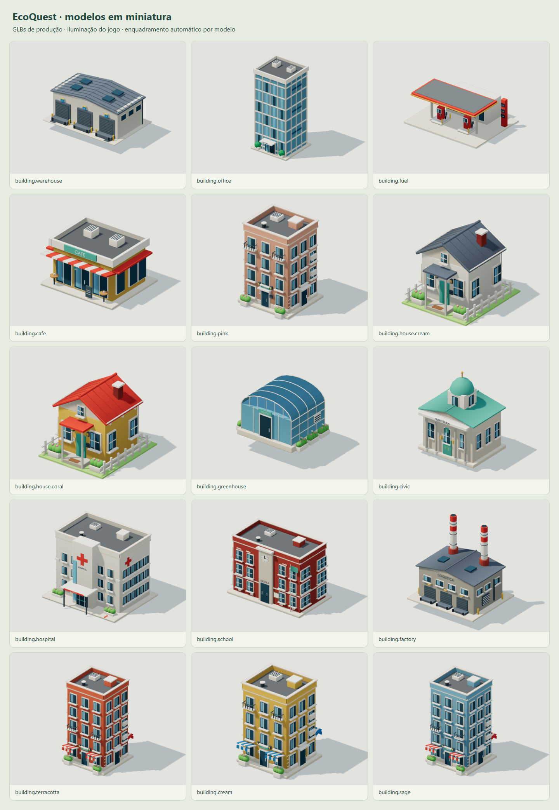
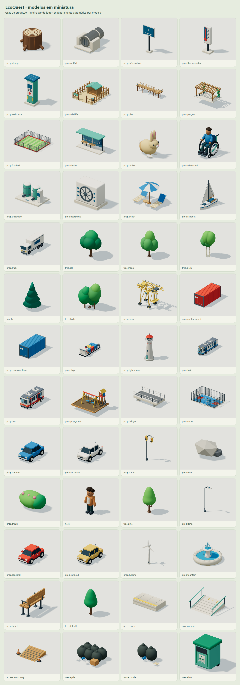
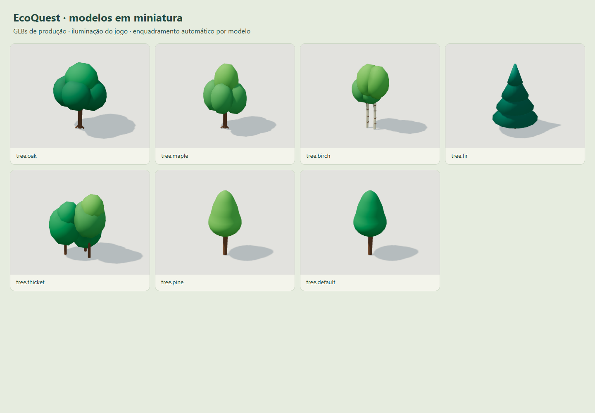

# Revisão de leitura visual e acabamento

> Registro da revisão anterior. A revisão atual cobre 67 modelos, com vistas de frente e verso: [auditoria individual](AUDITORIA-MODELOS.md) e [galeria](REVISAO-MODELOS.html).

Revisão dos 51 GLBs: comparação das pranchas de edifícios, objetos e árvores, seguida de verificação dentro do mapa. Os modelos preservam a linguagem de miniatura colorida da referência; não se trata de uma reprodução idêntica da imagem.

| Modelos | Resultado da revisão |
| --- | --- |
| Casas creme e coral | Terreno mais estreito, caminho frontal, maçaneta, calhas, condutores e divisões no telhado. Jardins compactos permitem fachadas mais próximas. |
| Prédios sage, coral, cream e pink | Mantidas molduras, peitoris, entradas e equipamentos do telhado. Toldos laterais extensos foram removidos, e marquises reduzidas, permitindo agrupar os edifícios sem interpenetrar. |
| Hospital | Sinalização na entrada, identificação e cruzes nas laterais reforçam sua função. |
| Escola | Terceiro pavimento, nome na fachada, bandeira e detalhes de alvenaria complementam o relógio e as janelas. |
| Prefeitura | Porta dupla, ferragens e identificação do pórtico completam colunas e cúpula. |
| Galpão portuário e caminhão | Docas e portas de enrolar, claraboias, emendas da cobertura e drenagem; cabine, vidros, retrovisores, rodas e travas do baú. |
| Fábrica | Janelas laterais, venezianas de ventilação e identificação de logística complementam docas e chaminés. |
| Estufa | Batentes, maçaneta, divisões nas extremidades curvas e ventiladores laterais. |
| Torre envidraçada | Variação dos painéis, porta de entrada, identificação e jardineiras. |
| Café | Identificação, cardápio, mesas, xícaras, maçaneta e correção do vidro na fachada posterior. |
| Posto | Totem de preços, letreiros, mostradores das bombas, mangueiras com retorno, bicos e proteção dos equipamentos. |
| Contêineres vermelho e azul | Estrutura de cantos, nervuras no teto, identificação, barras e maçanetas nas portas. |
| Guindaste | Escada, contraventamento, carro de içamento, motor e rodas. |
| Cargueiro | Vidros laterais da cabine, vigias, embarcações de apoio, chaminé, nervuras dos contêineres e equipamentos de amarração. |
| Farol | Porta, degrau, lente em anéis e remate superior. |
| Trem | Portas, reflexos, destino, limpadores, climatização, rodas com cubos, truques e engates nas duas extremidades. |
| Ônibus | Portas e degraus, destino, limpadores, retrovisores, lanternas, rodas com cubos e climatização. |
| Playground | Torre aberta com cobertura, plataforma, escada, guarda-corpos, escorregador e borda de madeira. |
| Carvalho, copa alta, bétula, conífera e árvores jovens | Cinco modelos novos para combinar em grupos; copas largas e sobrepostas, alturas variadas, galhos, raízes e detalhes de casca conforme o modelo. |
| Árvores originais e arbusto florido | Mantidos como vegetação urbana, com distribuição revista. |
| Quatro automóveis | Mantidos: vidros, pilares, maçanetas, retrovisores, rodas, faróis, lanternas, para-choques e grade já permitem leitura. |
| Poste e semáforo | Mantidos: braços, difusores, caixas e lentes já distinguem suas funções. |
| Banco e fonte | Mantidos: ripas, apoios e braços; bacias e jatos de água. |
| Ponte e quadra | Mantidos: pilares, guarda-corpos e marcação viária; pintura, cestas e cercamento. |
| Turbina e rochas | Mantidas as silhuetas próprias; geometria simples é intencional nesses objetos. |
| Degrau e duas rampas | Mantidos: junta e faixa na borda; corrimãos/piso tátil; tábuas e cones. A leitura das consequências das escolhas continua distinta. |
| Lixo, lixo parcial e lixeira | Mantidos: sacos amarrados, papelão, papéis, tampa, abertura e rodas. |
| Salvador | Mantidos roupa, rosto, cabelo, mãos, calçados e mochila. |

Todos os modelos continuam com arquivos Blender editáveis, oclusão em cores de vértices e GLBs otimizados. A auditoria de limites usa os arquivos reais exportados, não dimensões presumidas.

Pranchas reproduzíveis com servidor na porta 5173:

```sh
node scripts/capture-models.mjs buildings
node scripts/capture-models.mjs props
node scripts/capture-models.mjs expansion
node scripts/capture-models.mjs woodland
node scripts/audit-models.mjs
```







